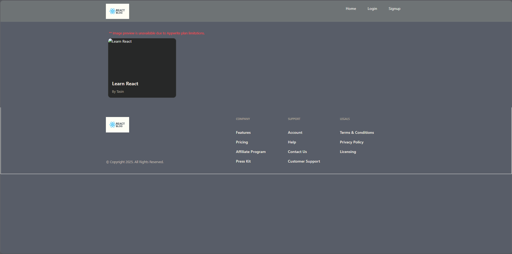
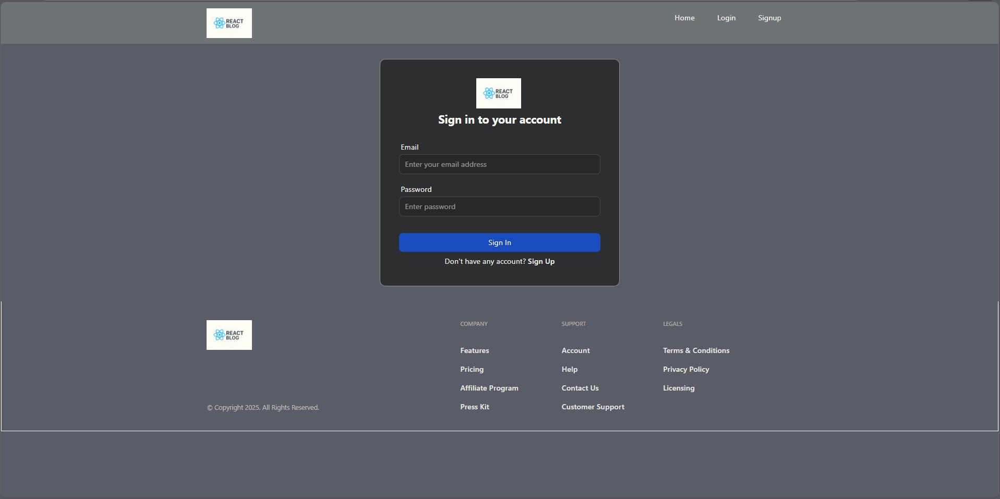
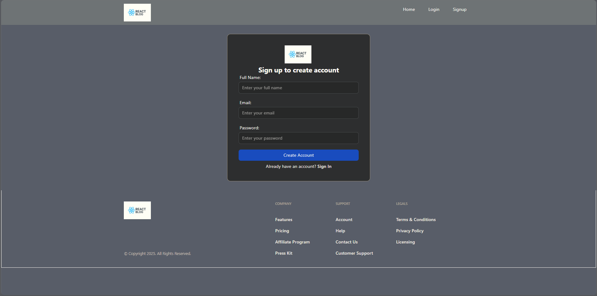
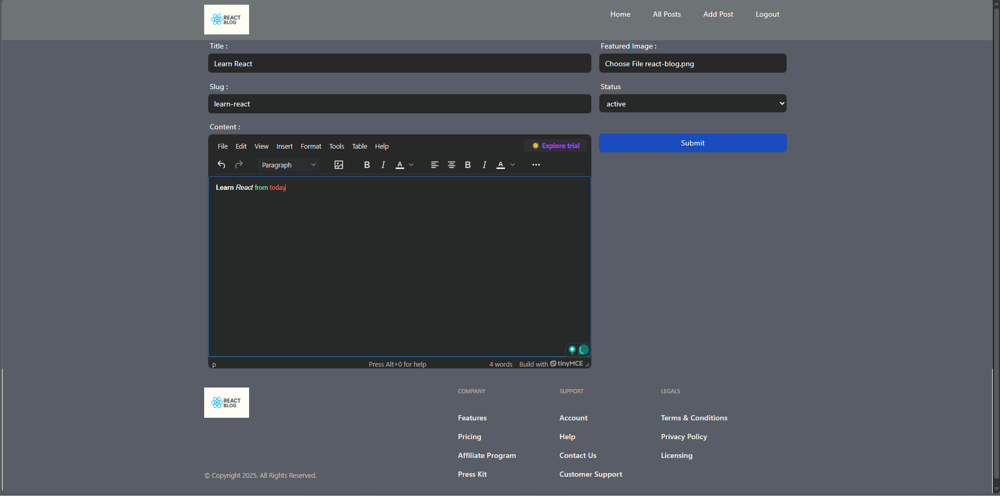
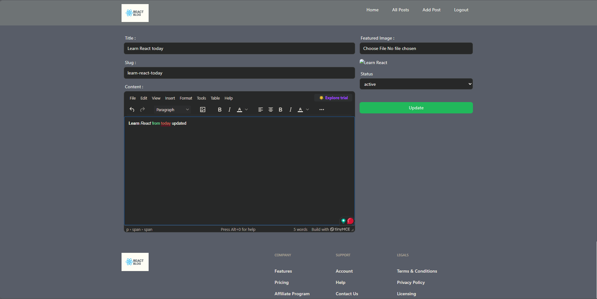
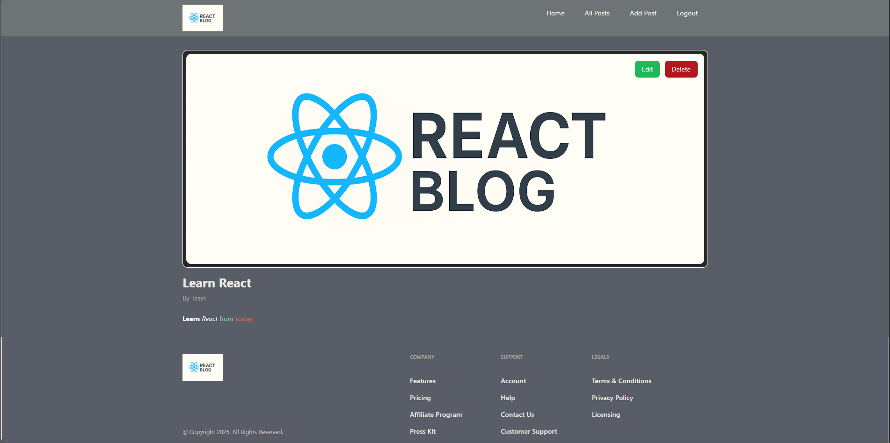
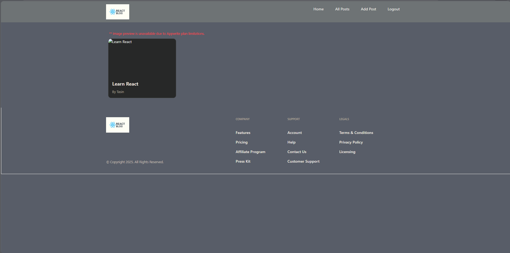

# 📝 React Blog Application

A modern, production-ready **blog application** built with **React 19**, **Redux Toolkit**, **React Hook Form**, and **Appwrite**.  
This project showcases real-world React architecture, authentication flow, rich text editing, state management, and clean UI practices.

## 🌐 Live Demo
👉 https://react-blog-gilt-two.vercel.app/

---

## 📸 Screenshots
### 🏠 Home Page


### 🔐 Login Page


### 🔐 Sign-up Page


### ✍️ Create Blog


### ✍️ Edit Blog


### 📄 Blog Details


### 📄 All Blog


---

## ✨ Features

- 🔐 User Authentication (Login / Signup)
- 📝 Create, Edit & Delete Blog Posts
- ✍️ Rich Text Editor powered by **TinyMCE**
- 🖼️ Image Upload & Preview using **Appwrite Storage**
- 🔒 Authorization: only post authors can delete their posts
- ⚡ Global state management with **Redux Toolkit**
- 📋 Form handling & validation with **React Hook Form**
- 🌐 Client-side routing using **React Router v7**
- 🎨 Fully responsive UI with **Tailwind CSS**
- ⚙️ Environment-based configuration
- 📦 Clean, modular & scalable folder structure

---

## 🛠️ Tech Stack

### Frontend
- React 19
- Redux Toolkit
- React Redux
- React Router DOM
- React Hook Form
- TinyMCE Editor
- Tailwind CSS

### Backend / Services
- Appwrite (Authentication, Database, Storage)

---

### ⚙️ Environment Variables
create a .env file in the project root:
- VITE_APPWRITE_ENDPOINT=your_appwrite_endpoint
- VITE_APPWRITE_PROJECT_ID=your_project_id
- VITE_APPWRITE_DATABASE_ID=your_database_id
- VITE_APPWRITE_COLLECTION_ID=your_collection_id
- VITE_APPWRITE_BUCKET_ID=your_bucket_id
- VITE_TINYMCE_API_KEY=your_tinymce_api_key

### 🚀 Getting Started
1. **Clone the repository**
   ```bash
   git clone https://github.com/TasinTausif/react-blog.git
   cd react-blog
   
2. Install dependencies
   ```bash
   npm install

3. Run the app
    ```bash
    npm run dev
